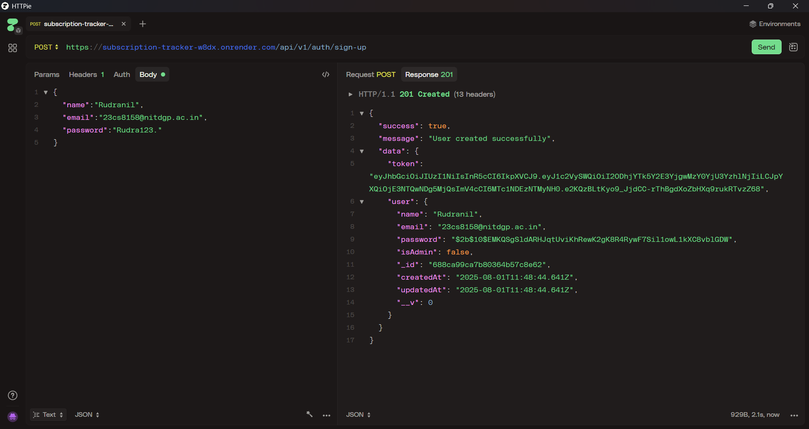
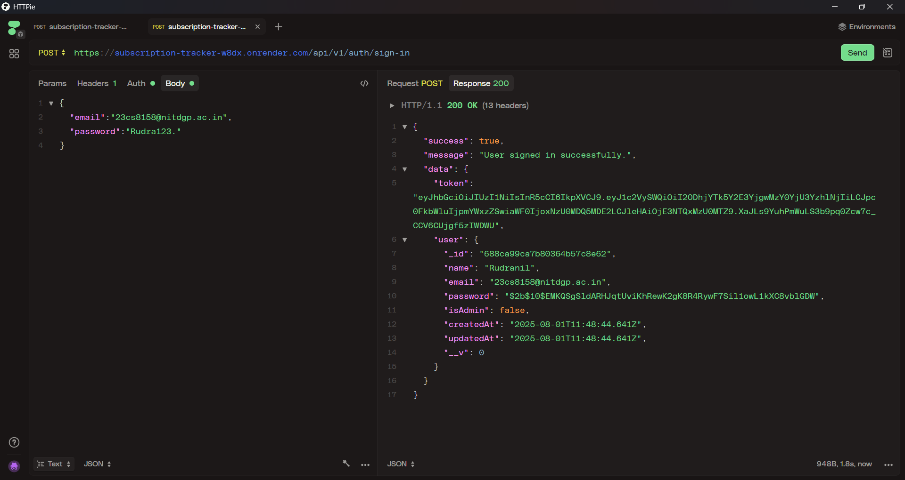
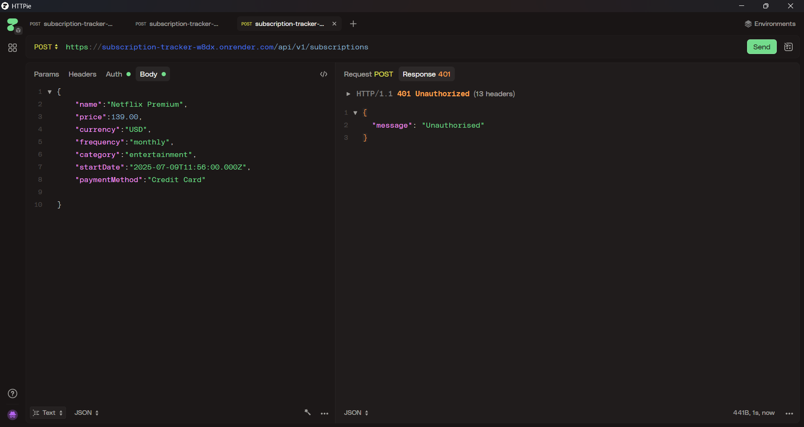
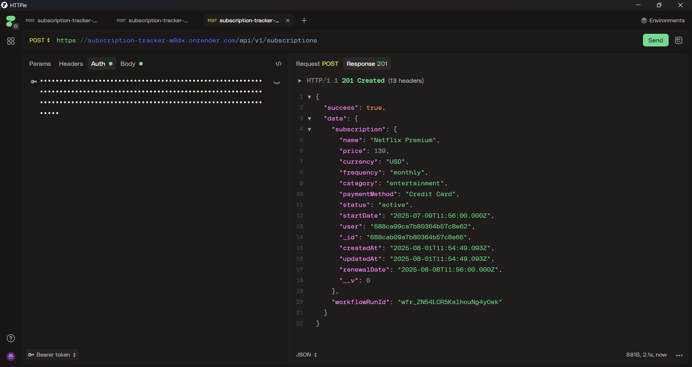
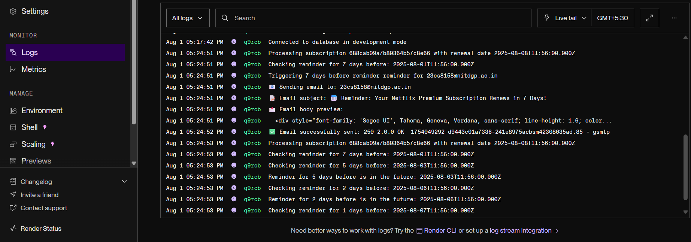
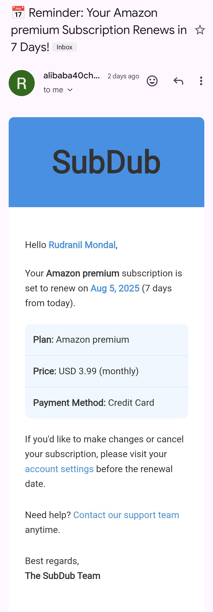

# 📅 Subscription Tracker – Backend API

A robust and efficient backend API for managing and tracking user subscriptions, with automated expiry reminders. Built with **Node.js**, **Express**, and **MongoDB**, powered by **Upstash Workflows** for scheduling, and secured via **Arcjet**.

🌐 [Live API](https://subscription-tracker-w8dx.onrender.com/) – _(Displays welcome message only)_

---

## ✨ Features

- 🔐 **User Authentication** – Secure JWT-based login system
- 📋 **CRUD API for Subscriptions** – Create, read, update, and delete user subscriptions
- 📧 **Email Reminders** – Sends expiry alerts via email
- ⏱ **Scheduled Tasks** – Automated reminders using Upstash Workflows (7, 5, 2, 1 days before expiry)
- 🛡 **Arcjet Integration** – Shields endpoints from abuse
- 🌿 **MongoDB** – Stores user and subscription data

---

## 📸 Screenshots

### 📍 Sign Up



### 📍 Sign In



### 📍 Unauthorized Access (Missing Token)



### 📍 Subscription Created Successfully



### 📍 Server Logs on Render



### 📍 Reminder Email Received



---

## 🛠 Tech Stack

| Category        | Technology           |
|----------------|----------------------|
| Backend         | Node.js, Express     |
| Database        | MongoDB              |
| Authentication  | JWT                  |
| Emails          | Nodemailer (SMTP)    |
| Scheduler       | Upstash Workflows    |
| Security        | Arcjet               |

---

## 🚀 Getting Started (Local Setup)

### 📦 Prerequisites

- Node.js and npm installed
- MongoDB (local or Atlas)
- SMTP credentials for sending emails
- Arcjet and Upstash accounts

### ⚙️ Installation

```bash
git clone https://github.com/yourusername/subscription-tracker.git
cd subscription-tracker
npm install

---

## 🔐 Environment Variables
 -Create a .env file in the root directory:

PORT=5000
MONGODB_URI=your_mongodb_connection_string
JWT_SECRET=your_jwt_secret

# Email credentials
EMAIL_USER=your_email@example.com
EMAIL_PASS=your_email_app_password

# Arcjet secret
ARCJET_SECRET=your_arcjet_secret

# Upstash QStash
QSTASH_URL=https://qstash.upstash.io
QSTASH_TOKEN=your_upstash_token
QSTASH_CURRENT_SIGNING_KEY=current_signing_key
QSTASH_NEXT_SIGNING_KEY=next_signing_key

##📌 Upstash keys will be provided on your Upstash QStash dashboard.

---

##📬 Email Reminders
##Your app sends reminder emails like this:

Subject: Your Netflix subscription is expiring in 2 days

Body:
"Hi Rudra, your subscription to Netflix is expiring soon. Renew to avoid service disruption!"

##Reminders are sent 7, 5, 2, and 1 day(s) before expiry using Upstash Workflows.

---

##📦 API Overview
-🧭 Base URL

(https://subscription-tracker-w8dx.onrender.com/api/v1)

##🔧 Sample Endpoints

| Method | Endpoint             | Description             |
| ------ | -------------------- | ----------------------- |
| POST   | `/auth/sign-up`      | Sign up a new user      |
| POST   | `/auth/sign-in`      | Sign in an existing user|
| GET    | `/subscriptions`     | Get all subscriptions   |
| POST   | `/subscriptions`     | Add a new subscription  |

---

##🧭 Roadmap
 --Add frontend dashboard (React/Next.js)
 --Recurring subscription support
 --Category filters and analytics
 --Dark mode UI (if frontend is added)

---